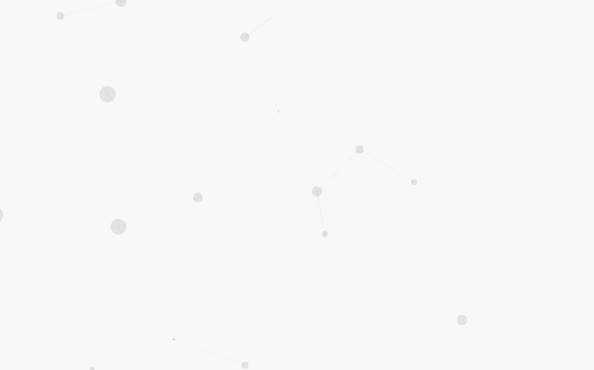

<html lang="en"><head>
    <meta charset="UTF-8">
    </head>
<body marginheight="0"><h6>之前在写h5页面的动画时看到EaselJsde，今天研究了一下顺便写下知乎登陆页面的动画</h6>

<a href="https://github.com/Kinco4TC/zhihuLoginCanva">作品地址</a>

<a href="http://162.219.125.119/zhihuLoginCanva/a.html">效果展示</a>

<h4>可选参数</h4>
<pre><code class="lang-javascript">id : demoCanvas,//canvas id
cicleNum :  30,//canvas中圆的个数
lineLenth : 300,//连接点线的最长长度
cicleColor : #e3e3e3,//圆的颜色
speed : 3,// 移动速度范围</code></pre>

</body></html>